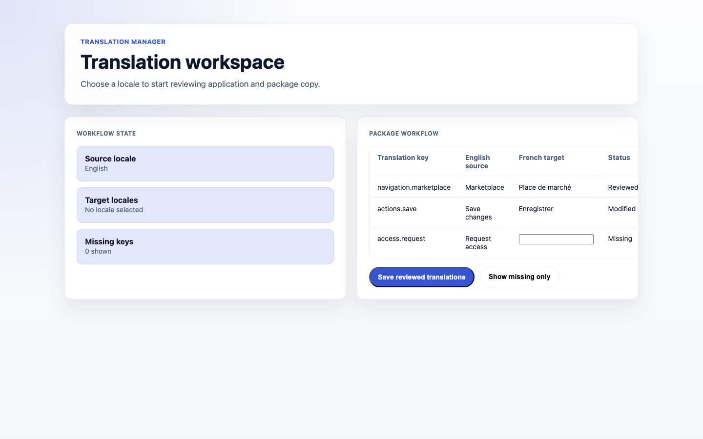
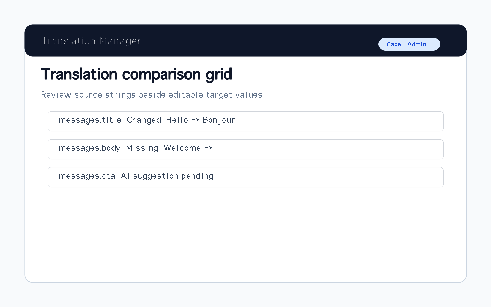

# Translation Manager

<!-- prettier-ignore-start -->

## What This Plugin Adds

Translation Manager is an **Available**, **No schema impact** Capell package in the **Capell Admin** product group. It ships as `capell-app/translation-manager` and extends these surfaces: admin.

Translation Manager gives admins a file-based editor for Laravel language files in your Capell app and installed packages, without migrations or new tables. Compare source and target locales side by side, spot missing and stale keys, and create or duplicate locale files from the admin workflow. Edits to package and vendor strings are written safely to Laravel's override paths, so upgrades never clobber your translations. Pair it with AI Orchestrator for reviewed translation drafts and with SEO Suite when multilingual search teams need translation coverage alongside SEO and AI-discovery workflows.

After install, admins get package-owned management or reporting surfaces inside Capell.

Status details:

- Status: Available
- Tier: premium
- Bundle: admin
- Composer package: `capell-app/translation-manager`
- Namespace: `Capell\TranslationManager`
- Theme key: not applicable

## Why It Matters

**For developers:** The package gives developers package-owned service providers, Actions, Data objects, Filament classes, and Blade views instead of pushing this behaviour into core or application code.

**For teams:** Manage Capell language files from one Filament page with side-by-side locale editing, missing and stale key checks, safe override writes, and optional reviewed AI drafting.

## Screens And Workflow

Screenshot contract: `docs/screenshots.json`.

- Translation Manager page with source, locale, file, and filter selectors in the no-results state (admin, required).
- Translation comparison grid with source strings, editable target strings, statuses, and entry selection (admin, required).
- Create locale modal (admin, required).
- Duplicate locale modal (admin, required).
- Translate selected action visible with AI translator support (admin, optional).
- Dirty and missing translation review state (admin, optional).
- Translation import and export actions (admin, optional).
- AI translation suggestion review (admin, optional).
- Locale publish readiness summary (admin, optional).

## Technical Shape

- Service providers: `Capell\TranslationManager\Providers\TranslationManagerServiceProvider`, `Capell\TranslationManager\Providers\AdminServiceProvider`.
- Config files: `packages/translation-manager/config/capell-translation-manager.php`.
- Filament classes: `TranslationManagerPage`.
- Actions: `BuildLocalePublishReadinessAction`, `BuildTranslationMemorySuggestionsAction`, `BuildTranslationReadinessMatrixAction`, `CreateLocaleFilesAction`, `DuplicateLocaleAction`, `ExportTranslationEntriesToCsvAction`, `ExportTranslationEntriesToPoAction`, `ExportTranslationEntriesToXliffAction`, `FilterTranslationEntriesAction`, `ImportTranslationEntriesFromCsvAction`, `ImportTranslationEntriesFromPoAction`, `ImportTranslationEntriesFromXliffAction`, `and 7 more`.
- Data objects: `AITranslationSuggestionData`, `LocalePublishReadinessData`, `LocaleSummaryData`, `MissingTranslationKeyData`, `TranslationCsvImportResultData`, `TranslationEntryData`, `TranslationFileData`, `TranslationSourceData`, `TranslationWriteData`.
- Manifest contributions: `admin-page: Capell\TranslationManager\Manifest\TranslationManagerPageContribution`.
- Health checks: `Capell\TranslationManager\Health\TranslationManagerHealthCheck`.
- Blade views: `packages/translation-manager/resources/views/filament/pages/translation-manager.blade.php`.

## Data Model

This package has no schema impact. It does not declare package-owned migrations or required tables.

Docs gap: document extension points here if the package delegates persistence to a host package.

## Install Impact

- Admin navigation: adds package-owned Filament classes when registered.
- Permissions: none declared in `capell.json`.
- Public routes: none detected in package route files.
- Database changes: no package migrations declared.
- Settings: no package settings declared.
- Queues or schedules: none detected in standard package paths.
- Cache tags: none declared.
- Commands: none declared.

## Common Pitfalls

- Verify the package is installed before expecting its provider, views, or extension contributions to run.
- Keep `composer.json`, `composer.local.json`, `capell.json`, docs, screenshots, and tests aligned when the package surface changes.

## Troubleshooting

| Symptom | Likely cause | Check | Fix |
| --- | --- | --- | --- |
| Package surface is missing after install | Provider or manifest is not loaded | Confirm `capell.json`, package `composer.json`, and provider registration | Reinstall the package, refresh Composer autoload, and clear host caches |

## Quick Start

1. Install the package: `composer require capell-app/translation-manager`.
2. Run the required setup: no package migrations are declared; clear cached config and routes if the host app uses caches.
3. Open the related Capell admin surface and verify Translation Manager appears.

## Next Steps

- [Package docs](docs/README.md)
- [Overview](docs/overview.md)
- [Screenshot contract](docs/screenshots.json)
- [Marketplace assets](docs/assets/marketplace/)
- [Capell content language plan](../../docs/CONTENT_LANGUAGE_PLAN.md)
- [Capell documentation design system](../../docs/DESIGN_SYSTEM.md)
- [Capell and package ERD notes](../../docs/erd/capell-and-package-erds.md)
- Related packages: [Ai Orchestrator](../ai-orchestrator/README.md), [Seo Suite](../seo-suite/README.md).
- Focused tests: `vendor/bin/pest packages/translation-manager/tests --configuration=phpunit.xml`.

<!-- prettier-ignore-end -->
