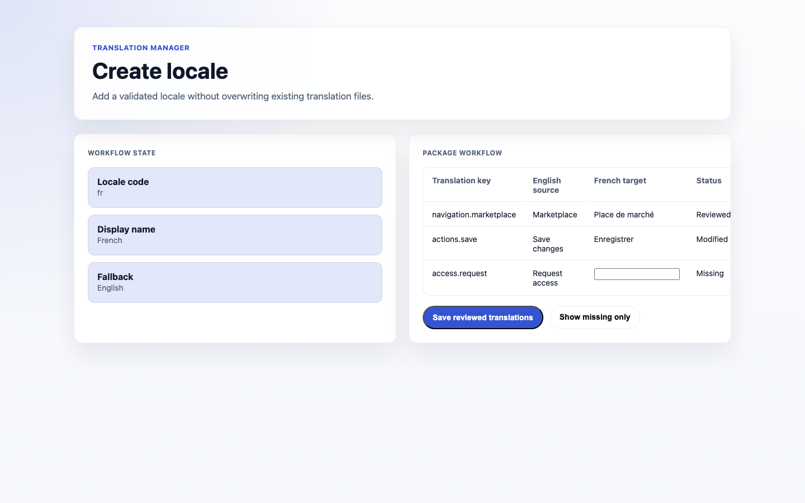
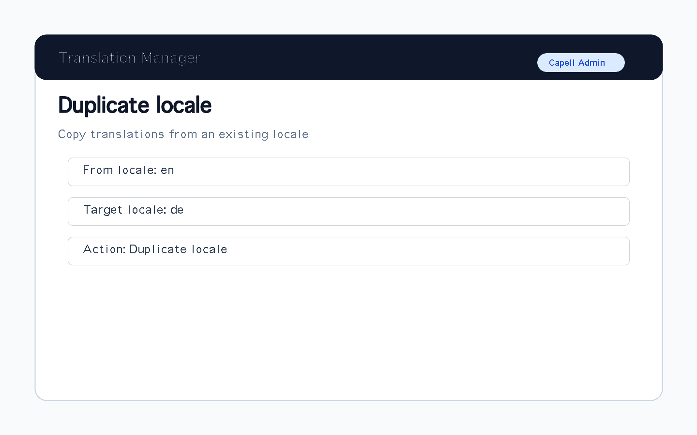
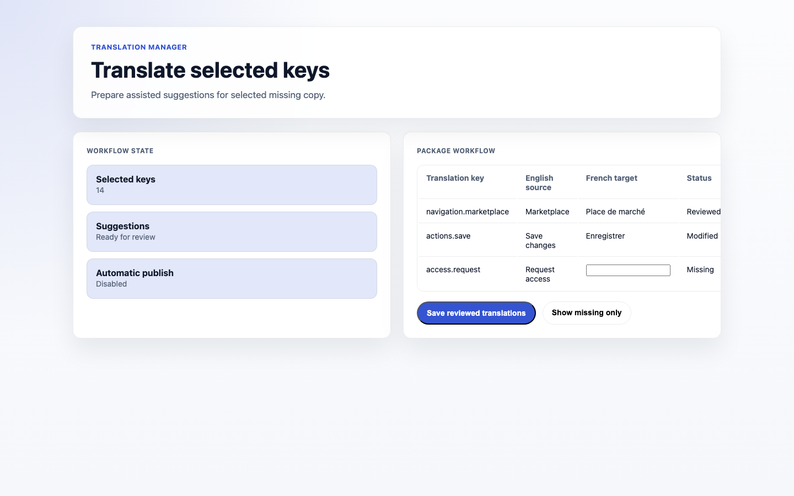

# Using Translation Manager

This guide is for editors who translate content and owners deciding which languages to support. Every step uses the labels you see on screen.

## Using Translation Manager (editor how-to)

### How to add a locale

1. Go to **Translation Manager**.
2. Click **Create locale** and choose the language.
3. Save. You can now translate content into it.

### How to start a locale from an existing one

1. In **Translation Manager**, click **Duplicate locale**.
2. Choose the **Source locale** to copy strings from, and the new target locale.
3. Save. The new locale starts with the copied strings so you only have to adjust what differs.

### How to edit a translation

1. Open the translation editor for your locale.
2. Edit each translation side by side with the original **Source** text. The status of each entry (for example **Missing** or **Changed**) is shown next to it.
3. Save as you go.

### How to find what still needs translating

1. Use the **Missing** filter.
2. It shows the content that has no translation yet in your locale. When nothing matches, the source, locale, file, and filter controls stay on screen so you can change your view.
3. Work through the list before launch.

### How to draft translations with AI

1. Select the entries you want drafted.
2. Use **Translate selected** to draft target values for them. This is available when an AI translator is set up for your site.
3. Review every suggestion, then accept or reject it individually.
4. Use **Save** to keep the accepted suggestions.

### How to import or export translations

1. First choose the **Source**, **Source locale**, **Target locale**, and translation **File** you want to work with.
2. To bring in translations for that selected file, use **Import contents**, choose **CSV**, **PO**, or **XLIFF**, then paste the translated contents into the form.
3. To send out that selected file, use **Export CSV**, **Export PO**, or **Export XLIFF**.

## Rolling out Translation Manager (for owners)

### Turn on first

- **One additional language, fully covered.** Pick your most important second language and complete it before adding more.

### Add when needed

| Need                           | Enable                                              |
| ------------------------------ | --------------------------------------------------- |
| More languages                 | Additional locales, one at a time                   |
| Work with external translators | **Export** and **Import** in their preferred format |

### Don't enable yet

- Don't launch a language with big gaps. Use the **Missing** filter to finish coverage first.

### Who does what

| Role                | First useful screen                               |
| ------------------- | ------------------------------------------------- |
| Translator / editor | The translation editor and the **Missing** filter |
| Site owner          | **Locales**: decide which languages to support    |

## Troubleshooting for editors

| What you see                       | What it means                             | What to do                                                  |
| ---------------------------------- | ----------------------------------------- | ----------------------------------------------------------- |
| A page shows in the wrong language | It isn't translated for that locale       | Find it via the **Missing** filter and translate it         |
| Coverage looks incomplete          | Some strings have no translation          | Work through the **Missing** list                           |
| An import didn't apply             | The file format didn't match              | Re-export in the right format, then **Import contents**     |
| Translations look out of date      | The source text changed after translating | Re-check the side-by-side editor and update the translation |
